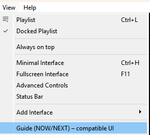
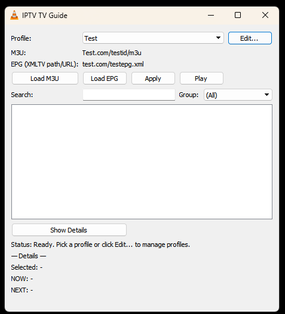
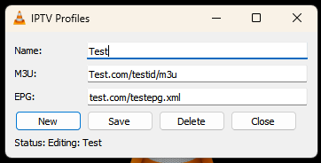
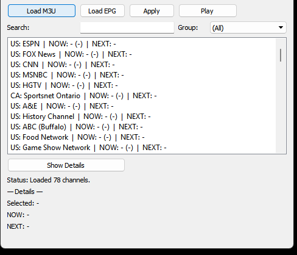
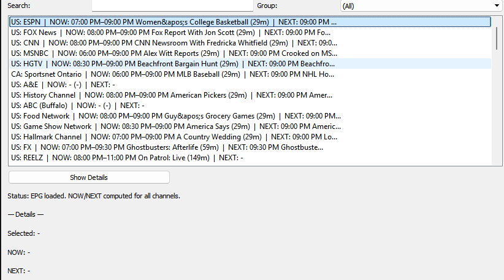
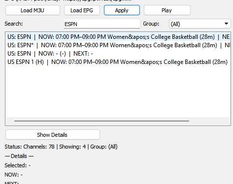
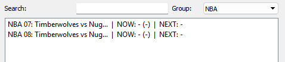
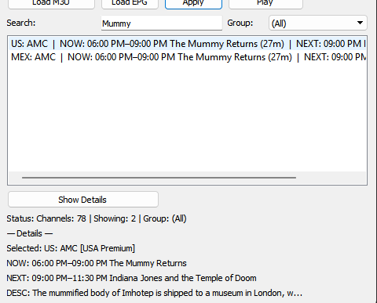
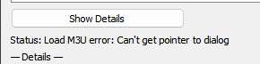

# IPTV TV Guide for VLC

`IPTV TV Guide` is a VLC extension that adds a basic TV-guide style browser for IPTV playlists.

It lets you load an M3U source and an XMLTV EPG source, browse channels, see `NOW` / `NEXT` program data, search by channel or program title, filter by group, and switch playback to the selected channel.

## Features

- Load IPTV channel lists from local M3U files or HTTP/HTTPS URLs
- Load XMLTV EPG data from local files or HTTP/HTTPS URLs
- Show `NOW` / `NEXT` guide data per channel
- Search by channel name, current program, or next program
- Filter channels by M3U group
- Play the selected channel directly in VLC
- Save multiple M3U/EPG profile combinations
- Edit profiles from the built-in profile manager

## Installation

1. Close VLC.
2. Copy [iptv_guide.lua](/c:/Users/USERNAME/AppData/Roaming/vlc/lua/extensions/iptv_guide.lua) into your VLC `lua/extensions` folder.
3. Start VLC.
4. Open the extension from `View > Guide (NOW/NEXT) - compatible UI`.

Typical extension folders:

- Windows: `%APPDATA%\Roaming\vlc\\lua\\extensions`
- Linux: `~/.local/share/vlc/lua/extensions`
- macOS: `~/Library/Application Support/org.videolan.vlc/lua/extensions`

## Usage

1. Open `View > Guide (NOW/NEXT) - compatible UI`.

2. Use the profile dropdown to select an existing profile.
3. Click `Edit...` to create, edit, or delete profiles.

4. In the profile editor, enter:
   - a profile name
   - an M3U file path or URL
   - an XMLTV EPG file path or URL
5. Save the profile and close the editor.

6. Click `Load M3U` to load channels.

7. Click `Load EPG` to populate `NOW` / `NEXT`.

8. Use:
   - `Search` to find channels or programs
   
   - `Group` + `Apply` to filter the list
   
   - `Show Details` to inspect the selected channel
   
   - `Play` to switch VLC to that channel

## Notes

- This extension uses VLC's Lua dialog API, which is limited. The UI is intentionally simple and utility-focused.
- Some VLC builds do not support all UI callbacks consistently, so behavior can vary slightly by version/platform.
- Large remote EPG files can take longer to load than local files.
- Remote EPG URLs are downloaded to a temporary local file before parsing to improve stability.

Known Issue-
1. Can't get pointer to dialog

- If you are facing this error, press the button again and retry or press another button like Load EPG. Switching profiles should also solve it.

## Privacy

- Profiles are stored locally in VLC's userdata/config area.
- Do not publish your generated config files if they contain personal IPTV or EPG URLs.
- The main generated files are typically:
  - `iptv_tv_guide.cfg`
  - `iptv_tv_guide_profiles.cfg`

## License

Choose a license before publishing. If you want others to freely use and modify it, `MIT` is a simple default.
